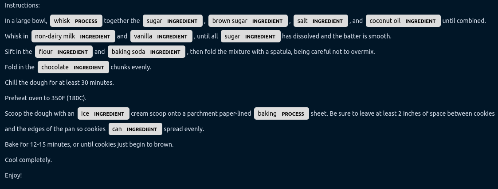

# Reading Recipes with NER

*Using Machine Learning Named-Entity Recognition to understand online recipes.*

We applied machine learning to the task of named entity recognition to identify ingredients, quantities and processed in recipes.

We have provided two tutorials:
* [Collecting and preparing data](./scraper/data/README.md#creation)
* [Labeling data and training the model](./recipes.ipynb)

And a [demo](./demo.ipynb).
To run the demo, open the notebook and follow the instructions to install the necessary packages.
